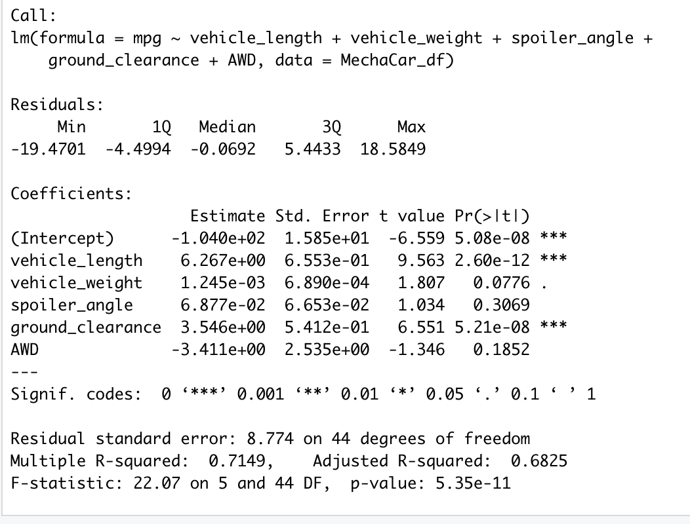
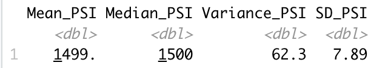
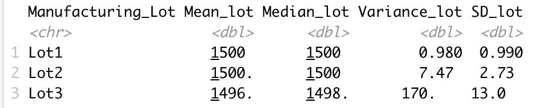
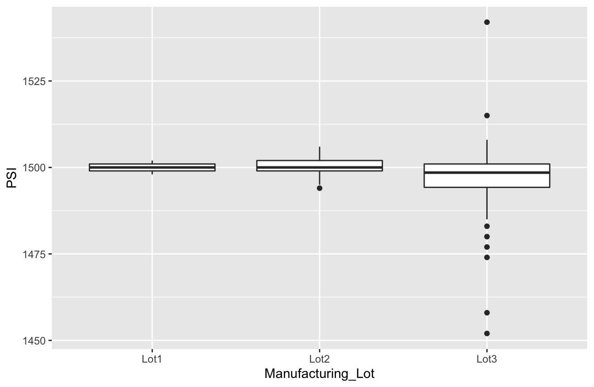

# MechaCar_Statistical_Analysis

## Linear Regression to Predict MPG
<b>mpg = 6.267vehicle_length + 0.0012vehicle_weight + 0.0688spoiler_angle + 3.546ground_clearance - 3.411AWD  -104.0</b>

 

From the above analysis output we can see that the "vehicle_length" and "ground_clearance" provided a non-random amount of variance to the model. It means they have a significant impact on miles per gallon. Conversely, the "vehicle_weight", "spoiler_angle" and "AWD" have p-Values that indicate a random amount of variance with the dataset.

The p-Value in this regression model is <b>5.35e-11</b>, which is much smaller than the assumed significance level of 0.05%. Thus, we can indicate that there is sufficient evidence to reject our null hypothesis, and thus induce that the slope of this linear regression model is not zero.

The R-squared value of this regression model is <b>0.7149</b>, which means approximately 71% of all mpg predictions will be determined by this model. Thus, this regression model predicts mpg of MechaCar prototypes effectively.

## Summary Statistics on Suspension Coils

* Statistical summary of all manufacturing lots:
 

* Statistical summary of each manufacturing lots:
 

The design specifications for the MechaCar suspension coils dictate that the variance of the suspension coils must not exceed 100 pounds per square inch (PSI). When looking into the statistical summary of all manufacturing lots, the variance is 62.3 which is well within the 100, so we can induce that the  current manufacturing data meet this design specification for all manufacturing lots in total.

However, then looking into the statistical summary of each manufacturing lots, we found that lot 3 has extraordinary large variance value 170, which is well beyond the limit. While lot 1 and lot 2 have very small variance value. So we indicate that lot 1 and lot 2 meet the design specification, however, lot 3 does not. We can visulize the ourtiers in lot 3 in a boxplot as follows, the dots beyon
 

