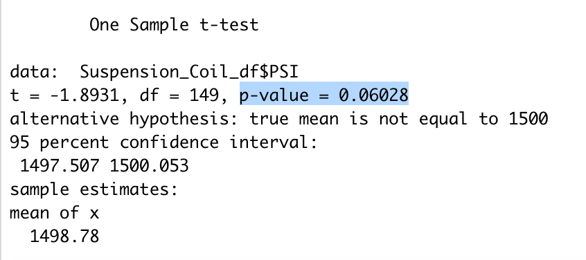
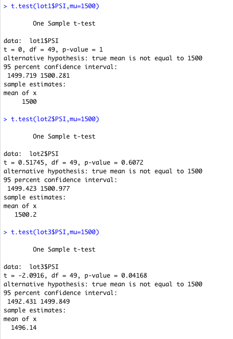

# MechaCar_Statistical_Analysis

## Linear Regression to Predict MPG
<b>mpg = 6.267vehicle_length + 0.0012vehicle_weight + 0.0688spoiler_angle + 3.546ground_clearance - 3.411AWD  -104.0</b>

 

From the above analysis output we can see that the "vehicle_length" and "ground_clearance" provided a non-random amount of variance to the model. It means they have a significant impact on miles per gallon. Conversely, the "vehicle_weight", "spoiler_angle" and "AWD" have p-Values that indicate a random amount of variance with the dataset.

The p-Value in this regression model is <b>5.35e-11</b>, which is much smaller than the assumed significance level of 0.05%. Thus, we can indicate that there is sufficient evidence to reject our null hypothesis, and thus induce that the slope of this linear regression model is not zero.

The R-squared value of this regression model is <b>0.7149</b>, which means approximately 71% of all mpg predictions will be determined by this model. Thus, this regression model predicts mpg of MechaCar prototypes effectively.

## Summary Statistics on Suspension Coils

* Statistical summary of all manufacturing lots:
 

* Statistical summary of each manufacturing lots:
 

The design specifications for the MechaCar suspension coils dictate that the variance of the suspension coils must not exceed 100 pounds per square inch (PSI). When looking into the statistical summary of all manufacturing lots, the variance is 62.3 which is well within the 100, so we can induce that the  current manufacturing data meet this design specification for all manufacturing lots in total.

However, then looking into the statistical summary of each manufacturing lots, we found that lot 3 has extraordinary large variance value 170, which is well beyond the limit. While lot 1 and lot 2 have very small variance value. So we indicate that lot 1 and lot 2 meet the design specification, however, lot 3 does not. We can visulize the ourtiers in lot 3 in a boxplot as follows, the dots beyon
 

## T-Tests on Suspension Coils

We perform t.test() function to determine if the PSI across all manufacturing lots is statistically different from the population mean of 1,500 pounds per square inch. Result is as follows:

 

From the above result,we see that the p-Value is 0.06, which is higher than the common significance level of 0.05, thus there is not sufficient evidence to reject the null hypothesis. In other words, the mean of all three of these manufacturing lots is statistically similar to the presumed population mean of 1500.

In addition, we perform t.test() function and its subset() argument to determine if the PSI for each manufacturing lot is statistically different from the population mean of 1,500 pounds per square inch.  Result is as follows:

Lot 1 sample has a p-value of 1, thus we cannot reject the null hypothesis. Lot 2 has a p-Value of 0.61, thus we cannot reject the null hypothesis either. These mean that there is no statistical difference between the observed sample mean of lot 1 and lot 2 and the presumed population mean (1500).

However, the p-value of lot 3 is 0.04, which is lower than the significance level of 0.05. And the sample mean is 1496.14 which is relatively away from 1500. So, we indicate to reject the null hypothesis. In other words, the sample mean and the presumed population mean are statistically different. <b>We recommend inspection on suspension coils in lot 3 to remove those beyond standard. </b>

## Study Design: MechaCar vs Competition

We designed a statistical study to compare performance of the MechaCar vehicles against performance of vehicles from other manufacturers. We are going to brief (1)the metric to be tested, (2)a null hypothesis, an alternative hypothesis and (3) a statistical test which is to test the hypothesis.

* <b>Metric</b>

a) Price

b) Resale Value

c) MPG (Fuel Efficiency)

d) Horse Power

e) Average Annual Cost of Maintenance

f) Safety rating

* <b>Hypothesis</b>

Null Hypothesis (Ho): MechaCar is price competitive based on its performance on the above matrics.

Alternative Hypothesis (Ha): MechaCar is NOT price competitive based on its performance on the above matrics.

* <b>Statistical Tests</b>

We will perform a multiple linear regression to determine the factors that have the highest correlation with the sales price, fianlly come up with a combination has the greatest impact on pricing. We will also perform Two-Sample t-Test to compare the average listing price versus other manufacturers, to assess if MechaCar is price competitive.

* <b>Data Sources</b>

We collect data of compared models from major manufacturers in most recent 3 years based on the above metircs.

